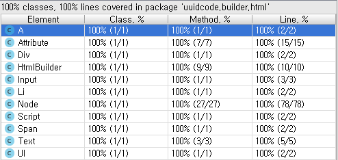

# html builder
## source
```java
@Test
public void htmlTag() {
    String html = html(
        head(),
        body(
            div(text("Hello, World!"))
        )
    ).html();

    this.assertHtml(html, "html");
}
```

### html result
```html
<html>
    <head></head>
    <body><div>Hello, World!</div></body>
</html>
```

## source
```java
@Test
public void selectBox() {
    List<String> nameList = IntStream.range(0, 3)
        .mapToObj(String::valueOf)
        .collect(Collectors.toList());

    Div div = div(
        input(),
        a(
            text("heart"),
            span().addClass("ico_comm")
        ),
        ul(this.createLiList(nameList)),
        script(text("var i = 'Hello, World!';"),
            text("console.log(i);"))
    );

    div.setId("projectTypeContainer").addClass("opt_comm4");
    div.getChildNodeList().get(0)
        .setType("hidden")
        .setName("projectType")
        .setId("projectType")
        .setValue("HEART");

    div.getChildNodeList().get(1).setId("projectTypeLabel")
        .addClass("link_selected");
    div.getChildNodeList().get(2).addClass("list_opt");

    this.assertHtml(div.html(), "selectBox");
}

private List<Node> createLiList(List<String> nameList) {
    return nameList.stream()
        .map(i -> a(text(i)).setId("type_" + i)
                .setHref("http://www.google.com?q=" + i))
        .map(a -> li(a))
        .collect(Collectors.toList());
}

```

## html result

```html
<div id="projectTypeContainer" class="opt_comm4">
    <input type="hidden" name="projectType" id="projectType" value="HEART">
    <a id="projectTypeLabel" class="link_selected">
        heart
        <span class="ico_comm"></span>
    </a>
    <ul class="list_opt">
        <li><a id="type_0" href="http://www.google.com?q=0">0</a></li>
        <li><a id="type_1" href="http://www.google.com?q=1">1</a></li>
        <li><a id="type_2" href="http://www.google.com?q=2">2</a></li>
    </ul>
    <script>
        var i = 'Hello, World!';
        console.log(i);
    </script>
</div>
```

## source

```java
@Test
public void bootstrap() {
    String html = html(
        head(
            link().stylesheet().setHref("https://maxcdn.bootstrapcdn.com/bootstrap/3.3.7/css/bootstrap.min.css"),
            link().stylesheet().setHref("https://maxcdn.bootstrapcdn.com/bootstrap/3.3.7/css/bootstrap-theme.min.css"),
            script().setSrc("https://maxcdn.bootstrapcdn.com/bootstrap/3.3.7/js/bootstrap.min.js")
        ),
        body(
            div(
                form(
                    div(
                        label(
                            text("Email")
                        ).addClass("col-sm-2", "control-label").setFor("inputEmail"),
                        div(
                            input().text().addClass("form-control").setId("inputEmail").setPlaceholder("Email")
                        ).addClass("col-sm-10")
                    ).addClass("form-group"),
                    div(
                        label(
                            text("Password")
                        ).addClass("col-sm-2", "control-label").setFor("inputPassword"),
                        div(
                            input().password().addClass("form-control").setId("inputPassword").setPlaceholder("Password")
                        ).addClass("col-sm-10")
                    ).addClass("form-group"),
                    div(
                        div(
                            button(
                                text("Sing in")
                            ).submit().addClass("btn", "btn-primary")
                        ).addClass("col-sm-offset-2", "col-sm-10")
                    ).addClass("form-group")
                ).addClass("form-horizontal")
            ).addClass("panel-body")
        )
    ).html();

    this.assertHtml(html, "bootstrap");
}
```

## html result
```html
<html>
    <head>
        <link rel="stylesheet" href="https://maxcdn.bootstrapcdn.com/bootstrap/3.3.7/css/bootstrap.min.css"></link>
        <link rel="stylesheet" href="https://maxcdn.bootstrapcdn.com/bootstrap/3.3.7/css/bootstrap-theme.min.css"></link>
        <script src="https://maxcdn.bootstrapcdn.com/bootstrap/3.3.7/js/bootstrap.min.js"></script>
    </head>
    <body>
        <div class="panel-body">
            <form class="form-horizontal">
                <div class="form-group">
                    <label class="col-sm-2 control-label" for="inputEmail">Email</label>
                    <div class="col-sm-10"><input type="text" class="form-control" id="inputEmail" placeholder="Email"></div>
                </div>
                <div class="form-group">
                    <label class="col-sm-2 control-label" for="inputPassword">Password</label>
                    <div class="col-sm-10"><input type="password" class="form-control" id="inputPassword" placeholder="Password"></div>
                </div>
                <div class="form-group"><div class="col-sm-offset-2 col-sm-10"><button type="submit" class="btn btn-primary">Sing in</button></div></div>
            </form>
        </div>
    </body>
</html>
```

## coverage

